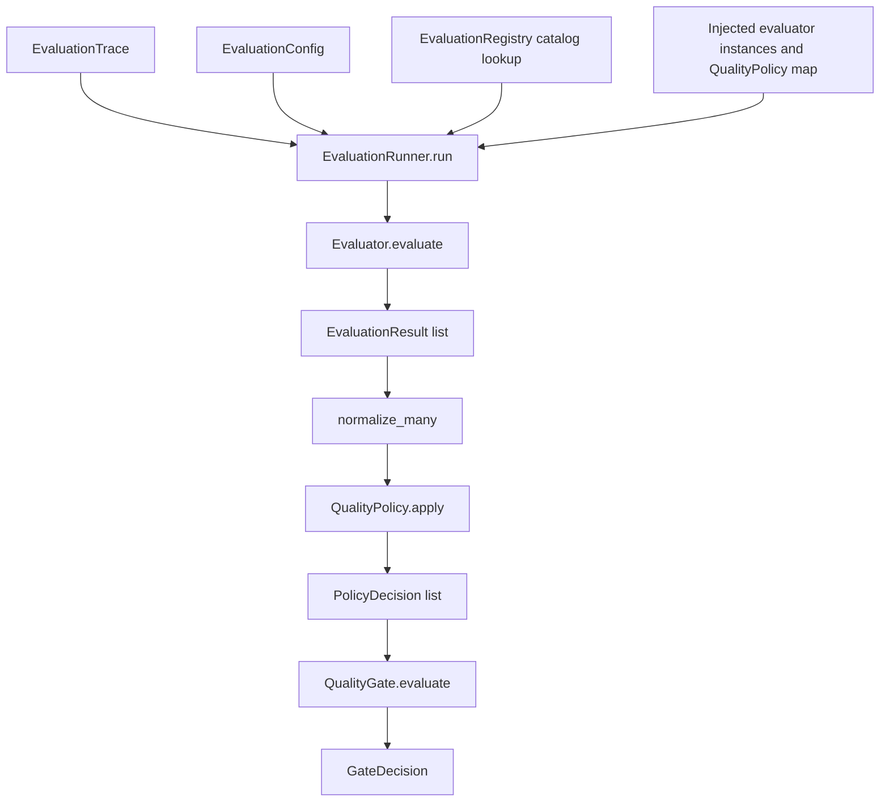

# LLM / RAG evaluation — Phase 1 POC and Phase 2 evaluation core

This repository contains two layers.

| Phase | What it is | Status |
|---|---|---|
| Phase 1 | RAGAS-based evaluation POC (Together AI + external RAG demo) | Historical / baseline. Retained. Not the foundation for new work. |
| Phase 2 | Provider-agnostic AI evaluation core (`src/ai_qe_eval`) | COMPLETE / FROZEN |
| Phase 3 | Platform evolution | STARTING (documentation alignment only so far) |

```text
Phase 1
RAGAS-based Evaluation POC
        ↓
Phase 2
Provider-Agnostic AI Evaluation Core
        ↓
Phase 3
Platform Evolution
```

Future work must extend the Phase 2 contracts. Do not grow new framework behavior by editing the original RAGAS pytest scripts.

Phase 2 is not a production evaluation platform. It does not include CI release blocking, observability, persistence, agent evaluation, or security evaluation.

---

## Phase 1 — historical RAGAS POC

The original implementation scores answers from an external RAG demo with [RAGAS](https://github.com/explodinggradients/ragas) 0.2.15. The judge is an open model on [Together AI](https://www.together.ai/) through the OpenAI-compatible client.

It remains in the repository as:

* historical implementation
* baseline / reference
* source of the live evaluation experiments

It is **not** the architectural foundation for later phases. The live tests call RAGAS directly (`utils.py`, `conftest.py`, root `test_*.py`). They do not go through `EvaluationRunner`.

Phase 1 metrics still present: context precision (without reference), context recall, faithfulness, response relevancy, factual correctness.

Phase 1 thresholds in `utils.py` (`RAGAS_THRESHOLD_*`) are experimental POC gates. They are **not** `QualityPolicy` and they are **not** production-validated.

### Known live-integration issue (not a Phase 2 defect)

With the file default judge `mistralai/Mixtral-8x7B-Instruct-v0.1`, Together returns `model_not_available` for serverless access. The four root live tests then fail (`test_context_precision.py`, `test_context_recall.py`, `test_faithfulness.py`, `test_resp_relevancy_factual_correctness.py`; the last also reports a missing/NaN `answer_relevancy` score). This is a Phase 1 provider/model availability issue. Phase 2 unit tests do not call Together.

Last measured during the Phase 2 freeze review: `pytest tests -q` — 206 passed. `pytest -q` — 206 passed and those 4 live failures. Do not treat that count as a new measurement from this documentation change.

### Install and configure (Phase 1)

```bash
git clone https://github.com/atagare1/llm-rag-evaluation-ragas.git
cd llm-rag-evaluation-ragas
python -m venv venv
source venv/bin/activate  # or venv\Scripts\activate on Windows
pip install -r requirements.txt
```

Copy `.env.example` to `.env`. Do not commit `.env`.

```env
OPENAI_API_KEY=your_together_ai_key
OPENAI_BASE_URL=https://api.together.xyz/v1
RAG_API_URL=https://rahulshettyacademy.com/rag-llm/ask
RAGAS_LLM_MODEL=mistralai/Mixtral-8x7B-Instruct-v0.1
RAGAS_EMBEDDING_MODEL=intfloat/multilingual-e5-large-instruct
```

Live tests skip when `OPENAI_API_KEY` is unset. `pytest.ini` puts `src` on `pythonpath` and disables the DeepEval pytest plugin (`-p no:deepeval`) so collection does not require DeepEval’s optional providers.

```bash
pytest          # unit tests plus live RAGAS tests when a key is set
pytest tests -q # Phase 2 and Phase 1 unit tests; no Together or RAG API
```

Experimental Phase 1 gates: context precision `> 0.8`, context recall `> 0.7`, faithfulness `> 0.8`, answer relevancy `> 0.8`, factual correctness `> 0.8`.

Together AI is the OpenAI-compatible host. Model choice is `RAGAS_LLM_MODEL`. This POC does not benchmark multiple models.

---

## Phase 2 — canonical architecture

Package: `src/ai_qe_eval`. The core is provider-neutral. RAGAS and DeepEval appear only as evaluator adapters.

Logical flow for one trace:

```text
EvaluationTrace
       +
EvaluationConfig          (which capability names should run)
       ↓
EvaluationRunner
       ↓
EvaluationRegistry        (capability catalog lookup)
       +
injected Evaluator        (instance map; not stored in the registry)
       ↓
EvaluationResult[]
       ↓
Result normalizer         (normalize_many)
       ↓
QualityPolicy.apply       (one policy per result metric)
       ↓
PolicyDecision[]
       ↓
QualityGate.evaluate
       ↓
GateDecision
```

`EvaluationRunner.run(trace, configuration)` still returns `GateDecision` for one trace. `run_many(traces, configuration)` evaluates each trace with the same config, in order, and stores one `EvaluationRun`. `traces[i]` matches `trace_evaluations[i]`, which holds that trace's normalized results and policy decisions. `results` and `decisions` are those same objects flattened in trace order. One `QualityGate.evaluate` call receives that flat decision list, so the existing any-fail rule applies to every policy decision in the run. There is no average, pass rate, or other run score. A failure still raises and clears `last_run` for that call. An empty trace list raises `ValueError`.



The registry does not sit between config and the runner as an executor. `EvaluationConfig` selects names. `EvaluationRegistry.get` checks that the name is catalogued. The executable evaluator is supplied by the caller.

### Component responsibilities

| Component | Module | Responsibility |
|---|---|---|
| `EvaluationTrace` | `domain/trace.py` | Canonical input: `trace_id`, `scenario_type`, `input`, `output`, `expected`, optional `application_id`, `retrieval`, `turns`, `events`, `raw`. Evaluators receive this object. The runner does not rebuild or mutate it. |
| Trace events | `domain/events.py` | Optional `events` entries are dicts with a `type` key (`make_trace_event`). No evaluator consumes them yet. Typed event classes are not implemented. |
| `EvaluationRun` / `TraceEvaluation` | `domain/run.py` | One execution record. `traces[i]` aligns with `trace_evaluations[i]` (`results` and `decisions` for that trace). Flat `results` / `decisions` follow the same order. `gate_decision` is the existing gate outcome for those decisions. The run does not evaluate or aggregate scores. |
| `EvaluationResult` | `domain/result.py` | What one metric measurement is: `metric`, `evaluator`, `score`, optional `reason`, `raw_result`. No threshold, no pass/fail, no severity. |
| `Evaluator` | `domain/evaluator.py` | Sync protocol: `evaluate(trace, configuration=None) -> list[EvaluationResult]`. One evaluator may return more than one result. `configuration` is opaque and unused by current adapters. |
| `EvaluationRegistry` / `EvaluationCapability` | `domain/registry.py` | Catalog of what can be named: `name`, `evaluator` (string), `category`. Duplicate register raises `ValueError`. Missing `get` raises `KeyError`. It does not store instances, thresholds, or policies. |
| `EvaluationConfig` | `domain/config.py` | What should run: ordered `evaluations: list[str]`. Duplicates raise `ValueError`. Empty list is valid. It does not hold models, prompts, credentials, or thresholds. |
| `DeterministicEvaluator` | `evaluators/deterministic.py` | `metric="exact_match"`, `evaluator="deterministic"`. Score `1.0` if `output == expected`, else `0.0`. No provider. |
| `RAGASFaithfulnessEvaluator` | `evaluators/ragas.py` | Adapter for RAGAS `Faithfulness` only. Maps `input` / `output` / `retrieval` (`page_content` or string) to `SingleTurnSample`. `metric="faithfulness"`, `evaluator="ragas"`. Other Phase 1 RAGAS metrics are not this adapter. **Implemented. Not live-validated** through the runner. |
| `DeepEvalGEvalCorrectnessEvaluator` | `evaluators/deepeval.py` | Adapter using DeepEval GEval as the mechanism. `metric="correctness"`, `evaluator="deepeval"` (not `"geval"`). Maps `input` / `output` / `expected`. **Implemented. Not live-validated.** |
| Result normalizer | `normalization/result_normalizer.py` | `normalize` / `normalize_many` copy an `EvaluationResult` and deepcopy `raw_result`. They do not change the score, apply policy, or rewrite vendor semantics. |
| `QualityPolicy` / `PolicyDecision` | `policy/quality_policy.py` | Policy owns `metric`, `operator`, `threshold`. Operators: `>`, `>=`, `<`, `<=`, `==`, `!=`. `apply` compares one numeric score and returns `PolicyDecision` (`passed` lives here). Metric mismatch raises `ValueError`. The score on the result is not modified. |
| `QualityGate` / `GateDecision` | `gate/quality_gate.py` | Gate consumes `PolicyDecision` objects and returns one `GateDecision(passed, decisions, reason)`. Any `passed is False` fails the gate. Empty decision list passes. The gate does not re-check score against threshold and does not average scores. This is an in-process decision, not a CI or deployment gate. |
| `EvaluationRunner` | `runner/evaluation_runner.py` | `run(trace, configuration) -> GateDecision` delegates to `run_many([trace], configuration)`. Resolves catalog names, calls injected evaluators, normalizes, applies policies, then calls the gate once. |

### Provider-agnostic boundary

Domain, policy, gate, normalizer, and runner do not import RAGAS or DeepEval. Adapters do.

```text
                 Evaluator protocol
                        │
       ┌────────────────┼────────────────┐
       │                │                │
 Deterministic     RAGAS adapter    DeepEval adapter
 exact_match       Faithfulness     GEval correctness
       │                │                │
       └────────────────┼────────────────┘
                        ↓
               EvaluationResult
```

Implemented adapters are only the three above. G-Eval is the DeepEval mechanism inside `DeepEvalGEvalCorrectnessEvaluator`, not a separate framework. Additional providers would be new adapters that return `EvaluationResult`. They are not implied by the protocol alone.

Phase 1 still has its own RAGAS path outside this diagram.

### What Phase 2 does not decide

* `EvaluationResult.score` is not pass/fail.
* `QualityPolicy` is not the release decision.
* `QualityGate` is not GitHub Actions, Jenkins, or a deployment block.
* Empty `EvaluationConfig` runs nothing and delegates `[]` to the gate, which passes.

---

## Phase 3 — platform evolution (not implemented here)

Status: **STARTING**. This documentation change does not add runtime behavior.

Intentionally deferred:

* Run-level score aggregation, pass rates, or a gate rule other than the existing any-fail over collected policy decisions
* CI quality-gate integration (mapping `GateDecision.passed` to a pipeline)
* Observability / tracing, including Langfuse
* Agent or trajectory evaluation
* MCP-based execution
* Security or adversarial evaluation
* Distributed execution
* Persistence and lineage
* Migrating the remaining Phase 1 RAGAS metrics onto adapters

---

## Tests

| Suite | Role |
|---|---|
| `tests/test_evaluation_*.py`, `test_trace_events.py`, `test_evaluator_contract.py` | Domain contracts |
| `tests/test_deterministic_evaluator.py` | Exact match |
| `tests/test_ragas_evaluator.py`, `tests/test_deepeval_evaluator.py` | Adapter mapping with stubs. No live LLM. |
| `tests/test_result_normalizer.py`, `test_quality_policy.py`, `test_quality_gate.py`, `test_evaluation_runner.py` | Normalization, policy, gate, thin runner |
| `tests/test_end_to_end.py` | Pipeline with test doubles, plus a local `DeterministicEvaluator` smoke test |
| Root `test_*.py` | Phase 1 live RAGAS. Separate from the Phase 2 runner. |

End-to-end tests prove delegation order (`evaluator` → `normalizer` → `policy` → `gate`). They are not live RAGAS or DeepEval runs.
