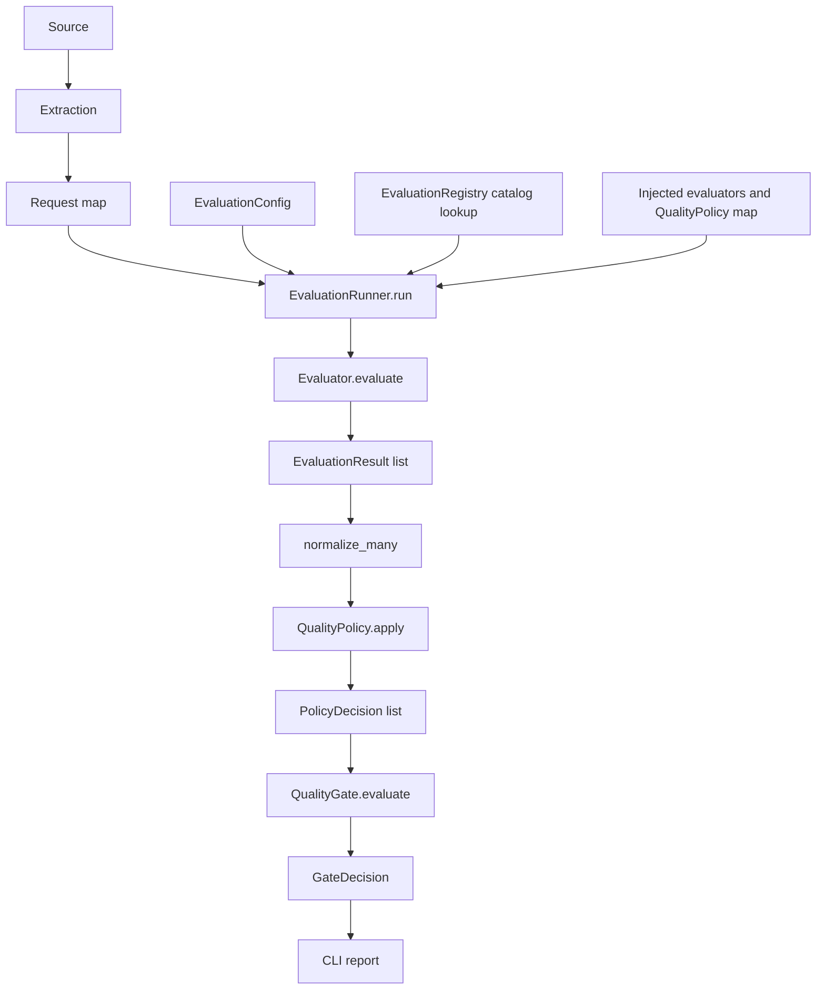

# AI-QE Evaluation Platform

Agent and RAG quality is not one score. Tool order can be correct while the application state is wrong. A retrieved context can be relevant while the answer is unfaithful. This repository is a provider-agnostic evaluation engine for that class of problem: separate metrics, explicit policies, and one fail-closed QualityGate.

The current flagship path is a Playwright MCP TodoMVC evaluation. Observed tool calls are captured, mapped into a Design A request, and scored by Tool Correctness, MCP Execution Health, and Final State. The default CLI uses **scripted** MCP execution. It does not open a live browser.

Package: [`src/ai_qe_eval`](src/ai_qe_eval). Historical RAGAS POC scripts remain in the repo as a baseline; they are not the foundation for new work.

| Layer | What it is | Status |
|---|---|---|
| Phase 1 | RAGAS POC (Together AI + external RAG demo) | Historical / retained |
| Phase 2 | Provider-agnostic evaluation core | Implemented |
| Phase 3+ | MCP / Langfuse capture, CLI, flagship demo | Implemented for the scope below |

Future work must extend the Phase 2 contracts. Do not grow new framework behavior by editing the original RAGAS pytest scripts.

---

## Architecture

Sources produce observations. Capture helpers extract `ToolInvocation` values. Those become a capability-keyed request map. `EvaluationRunner` is the only executor.

```text
source (scripted MCP, live Playwright MCP, or Langfuse observations)
        ↓
extraction (serialize / parse → ToolInvocation)
        ↓
Design A request map     {"capability": {"args": [...], "kwargs": {...}}}
        +
EvaluationConfig         (ordered capability names)
        ↓
EvaluationRunner
        ↓
Evaluator.evaluate(*args, **kwargs) → EvaluationResult[]
        ↓
normalize_many
        ↓
QualityPolicy.apply      (one policy per result metric)
        ↓
QualityGate.evaluate     (any policy fail fails the run)
        ↓
GateDecision + CLI report
```

There is no score average, pass rate, or combined run score. `EvaluationResult.score` is not pass/fail. `QualityPolicy` owns the threshold comparison. `QualityGate` is an in-process any-fail decision, not a CI or deployment plugin.



---

## Quick Start

Install from the repository root, then run the scripted MCP demo. The CLI does not start `@playwright/mcp`, a browser, or Langfuse.

```bash
git clone https://github.com/atagare1/llm-rag-evaluation-ragas.git
cd llm-rag-evaluation-ragas
python -m venv venv
source venv/bin/activate  # or venv\Scripts\activate on Windows
pip install -r requirements.txt

PYTHONPATH=src python -m ai_qe_eval
PYTHONPATH=src python -m ai_qe_eval --scenario fail
```

Exit codes: QualityGate PASS = `0`, FAIL = `1`.

### PASS — correct tools, healthy execution, expected final state

```text
AI-QE Evaluation
────────────────────────────────
Scenario: MCP P0 Demo

Evaluator                  Score    Result
Tool Correctness            1.00     PASS
MCP Execution Health        1.00     PASS
Final State                 1.00     PASS

Quality Gate                         PASS
────────────────────────────────
```

### FAIL — same tool sequence, wrong application outcome

The fail demo types `Buy bread` instead of `Buy milk`. Tool Correctness and MCP Execution Health still pass. Final State fails, so the gate fails. The CLI prints the evaluator reason on failing rows only.

```text
AI-QE Evaluation
────────────────────────────────
Scenario: MCP P0 Demo

Evaluator                  Score    Result
Tool Correctness            1.00     PASS
MCP Execution Health        1.00     PASS
Final State                 0.00     FAIL
  Final-state check failed.

Quality Gate                         FAIL
────────────────────────────────
```

---

## TodoMVC demo

Goal: add `Buy milk` on the [Playwright TodoMVC](https://demo.playwright.dev/todomvc) demo.

Scripted tool order (also the QE-supplied expected names):

`browser_navigate` → `browser_snapshot` → `browser_click` → `browser_type` → `browser_click` → `browser_snapshot`

The CLI demo uses `SequenceToolSelector` and a `ScriptedMcpSession` that returns predetermined `CallToolResult` values. `run_playwright_mcp_agent` still captures observations through the real serialize/capture helpers. `mcp_p0_request()` then builds the Design A map for the three P0 evaluators.

Final State is independent of tool names. It checks whether the last `browser_snapshot` contains a list item for `Buy milk`. Correct tool execution therefore does not imply a correct outcome: the fail scenario keeps the same six tools and `isError=false` results, types `Buy bread`, and the gate fails on Final State only.

The default CLI Tool Correctness path uses DeepEval name/order matching (`evaluation_params=[]`). Expected calls are QE-supplied names; they are not inferred from telemetry.

---

## Implemented evaluators

Adapters return `EvaluationResult`. They do not apply `QualityPolicy` or `QualityGate`.

**Deterministic** (`evaluators/deterministic.py`)

| Evaluator | Metric | Input |
|---|---|---|
| `DeterministicEvaluator` | `exact_match` | `output`, `expected` |
| `MCPExecutionHealthEvaluator` | `mcp_execution_health` | observed `ToolInvocation` results; fails on `isError=true` |
| `FinalStateEvaluator` | `final_state` | caller-supplied `bool` |

**RAGAS** (`evaluators/ragas.py`)

| Evaluator | Metric | Notes |
|---|---|---|
| `RAGASFaithfulnessEvaluator` | `faithfulness` | RAGAS 0.2.15 `Faithfulness` only. Other Phase 1 RAGAS metrics are not this adapter. |

**DeepEval** (`evaluators/deepeval.py`, `deepeval_tool_correctness.py`, `deepeval_turn_relevancy.py`)

| Evaluator | Metric |
|---|---|
| `DeepEvalGEvalCorrectnessEvaluator` | `correctness` |
| `DeepEvalFaithfulnessEvaluator` | `faithfulness` |
| `DeepEvalAnswerRelevancyEvaluator` | `answer_relevancy` |
| `DeepEvalContextualRelevancyEvaluator` | `contextual_relevancy` |
| `DeepEvalContextualPrecisionEvaluator` | `contextual_precision` |
| `DeepEvalContextualRecallEvaluator` | `contextual_recall` |
| `DeepEvalHallucinationEvaluator` | `hallucination` |
| `DeepEvalToolCorrectnessEvaluator` | `tool_correctness` |
| `DeepEvalTurnRelevancyEvaluator` | `turn_relevancy` |

The default CLI runs only the three P0 evaluators: `tool_correctness`, `mcp_execution_health`, `final_state`.

---

## Integrations

### Playwright MCP

Implemented in `integrations/playwright_mcp.py`, `playwright_mcp_agent.py`, and `playwright_mcp_selector.py`.

* Official package pin: `@playwright/mcp@0.0.82` over Python `mcp` stdio.
* Serializes `CallToolResult` to plain dicts, including snapshot sidecar resolution.
* `run_playwright_mcp_agent` executes an injected selector and captures `ToolInvocation` values.
* `mcp_p0_request()` is the Design A builder for the P0 evaluators.

**Default CLI:** scripted session, no `npx`, no browser. **Live validation:** separate `@pytest.mark.live` tests start the real Playwright MCP server against TodoMVC. Those tests are not the Quick Start path.

### Langfuse

Implemented in `integrations/langfuse_observations.py` and `capture/langfuse_trace.py`.

* Injected client. Paginates Observations API v2 `get_many` for one `trace_id` and waits for a settle predicate.
* Converts `TOOL` observations into `ToolInvocation` values.
* `ingest_langfuse_trace()` returns a Tool Correctness request map. Expected tool calls stay QE-supplied.
* Does not use `langfuse.trace()` or `api.trace.list`.
* The default CLI does not call Langfuse. Live Tool Correctness-through-runner tests are marked `live` and deselected from `pytest tests -q`.

---

## Validation

Deterministic baseline from `python -m pytest tests -q` (MVP-03, not re-measured by this README change):

**361 passed, 32 live tests deselected, 2 warnings.**

`pytest.ini` sets `-m "not live"` and `-p no:deepeval`. DeepEval is pinned at 4.2.6. A remaining DeepEval `HallucinationMetric` score-direction notice is informational; platform hallucination scoring is already higher-is-better with policy `>= 0.8`.

Live tests (Playwright MCP, Langfuse, RAGAS/DeepEval provider runs) exist under `tests/platform/` and are excluded from that baseline. Do not treat the deterministic count as live-provider proof.

Live DeepEval judges use `OPENROUTER_API_KEY`, `OPENAI_BASE_URL` (OpenRouter), and optional `DEEPEVAL_JUDGE_MODEL` (default `meta-llama/llama-3.3-70b-instruct`). RAGAS defaults are unchanged.

```bash
pytest tests -q          # deterministic baseline
pytest -m live           # live MCP / Langfuse / provider tests when configured
```

---

## Roadmap

**Implemented**

* Design A request maps and thin `EvaluationRunner`
* Registry, `EvaluationConfig`, result normalizer, `QualityPolicy`, `QualityGate`
* Deterministic, RAGAS Faithfulness, and DeepEval evaluator adapters listed above
* Playwright MCP capture/agent boundary and scripted CLI demo
* Langfuse observation retrieval → Tool Correctness request map
* Concise CLI report (no score aggregation)

**Not implemented / future**

* CI mapping of `GateDecision.passed` to a pipeline gate
* Persistence, lineage, or a dashboard
* Distributed execution
* Security or adversarial evaluation
* CLI coverage beyond the P0 MCP demo
* Remaining Phase 1 RAGAS metrics as Phase 2 adapters (context precision, context recall, response relevancy, factual correctness)
* Default-CLI live browser or Langfuse execution

---

## Phase 1 — historical RAGAS POC

The original implementation scores answers from an external RAG demo with [RAGAS](https://github.com/explodinggradients/ragas) 0.2.15. The judge is an open model on [Together AI](https://www.together.ai/) through the OpenAI-compatible client.

It remains in the repository as:

* historical implementation
* baseline / reference
* source of the live evaluation experiments

It is **not** the architectural foundation for later phases. The live tests call RAGAS directly (`utils.py`, `conftest.py`, root `test_*.py`). They do not go through `EvaluationRunner`.

Phase 1 metrics still present: context precision (without reference), context recall, faithfulness, response relevancy, factual correctness.

Phase 1 thresholds in `utils.py` (`RAGAS_THRESHOLD_*`) are experimental POC gates. They are **not** `QualityPolicy` and they are **not** production-validated.

### Known live-integration issue (not a Phase 2 defect)

With the file default judge `mistralai/Mixtral-8x7B-Instruct-v0.1`, Together returns `model_not_available` for serverless access. The four root live tests then fail (`test_context_precision.py`, `test_context_recall.py`, `test_faithfulness.py`, `test_resp_relevancy_factual_correctness.py`; the last also reports a missing/NaN `answer_relevancy` score). This is a Phase 1 provider/model availability issue. Phase 2 unit tests do not call Together.

Last measured during the Phase 2 freeze review: `pytest tests -q` — 206 passed. `pytest -q` — 206 passed and those 4 live failures. That count is historical. The current deterministic baseline is the Validation section above.

### Install and configure (Phase 1)

```bash
git clone https://github.com/atagare1/llm-rag-evaluation-ragas.git
cd llm-rag-evaluation-ragas
python -m venv venv
source venv/bin/activate  # or venv\Scripts\activate on Windows
pip install -r requirements.txt
```

Copy `.env.example` to `.env`. Do not commit `.env`.

```env
OPENAI_API_KEY=your_together_ai_key
OPENAI_BASE_URL=https://api.together.xyz/v1
RAG_API_URL=https://rahulshettyacademy.com/rag-llm/ask
RAGAS_LLM_MODEL=mistralai/Mixtral-8x7B-Instruct-v0.1
RAGAS_EMBEDDING_MODEL=intfloat/multilingual-e5-large-instruct
```

Live tests skip when `OPENAI_API_KEY` is unset. `pytest.ini` puts `src` on `pythonpath` and disables the DeepEval pytest plugin (`-p no:deepeval`) so collection does not require DeepEval’s optional providers.

```bash
pytest          # unit tests plus live RAGAS tests when a key is set
pytest tests -q # deterministic suite; no Together, RAG API, live MCP, or Langfuse
```

Experimental Phase 1 gates: context precision `> 0.8`, context recall `> 0.7`, faithfulness `> 0.8`, answer relevancy `> 0.8`, factual correctness `> 0.8`.

Together AI is the OpenAI-compatible host. Model choice is `RAGAS_LLM_MODEL`. This POC does not benchmark multiple models.

---

## Phase 2 contracts

Domain, policy, gate, normalizer, and runner do not import RAGAS or DeepEval. Adapters do.

| Component | Module | Responsibility |
|---|---|---|
| Request map | Runner input | `{"name": {"args": [...], "kwargs": {...}}}`. The runner does not rebuild the map. |
| `EvaluationRun` / `TraceEvaluation` | `domain/run.py` | Execution record. `requests[i]` aligns with `trace_evaluations[i]`. No score aggregation. |
| `EvaluationResult` | `domain/result.py` | `metric`, `evaluator`, `score`, optional `reason`, `raw_result`. No pass/fail. |
| `Evaluator` | `domain/evaluator.py` | `evaluate(*args, **kwargs) -> list[EvaluationResult]` |
| `EvaluationRegistry` | `domain/registry.py` | Name catalog only. Does not store instances or thresholds. |
| `EvaluationConfig` | `domain/config.py` | Ordered capability names. |
| Result normalizer | `normalization/result_normalizer.py` | Copies results. Does not change scores. |
| `QualityPolicy` | `policy/quality_policy.py` | Operators `>`, `>=`, `<`, `<=`, `==`, `!=`. `passed` lives here. |
| `QualityGate` | `gate/quality_gate.py` | Any `passed is False` fails. Empty decision list passes. |
| `EvaluationRunner` | `runner/evaluation_runner.py` | `run` / `run_many`. Resolves catalog names, calls injected evaluators, normalizes, applies policies, gates once. |

`EvaluationRunner.run(request, configuration)` returns `GateDecision` for one request map. `run_many` evaluates several request maps in order. One gate call uses the flat decision list. An empty request list raises `ValueError`. A runner failure clears `last_run` for that call.

### What the core does not decide

* `EvaluationResult.score` is not pass/fail.
* `QualityPolicy` is not the release decision.
* `QualityGate` is not GitHub Actions, Jenkins, or a deployment block.

---

## Tests

| Suite | Role |
|---|---|
| `tests/test_evaluation_*.py`, `test_evaluator_contract.py` | Domain contracts |
| `tests/test_deterministic_evaluator.py` | Exact match, final state, MCP health |
| `tests/test_ragas_evaluator.py`, `tests/test_deepeval_*.py` | Adapter mapping with stubs. No live LLM. |
| `tests/test_evaluation_runner.py`, `test_quality_policy.py`, `test_quality_gate.py` | Thin runner, policy, gate |
| `tests/test_cli.py`, `tests/test_cli_mcp_p0_demo.py` | Scripted CLI report and MCP demo through `EvaluationRunner` |
| `tests/platform/test_pv_*.py` | Platform validation, including `@pytest.mark.live` MCP / Langfuse / provider tests |
| Root `test_*.py` | Phase 1 live RAGAS. Separate from the Phase 2 runner. |

End-to-end deterministic tests prove delegation order (`evaluator` → `normalizer` → `policy` → `gate`). They are not live RAGAS, DeepEval-provider, Playwright MCP server, or Langfuse runs.
