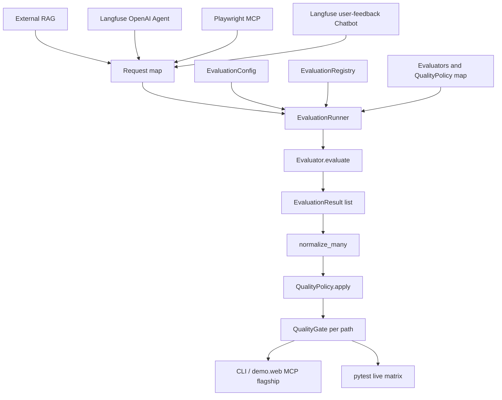

# AI-QE Evaluation Platform

One provider-agnostic evaluation engine, four independently gated AI system paths.

External RAG, Langfuse OpenAI Agent, Playwright MCP, and Langfuse user-feedback Chatbot each produce a request map. `EvaluationRunner` executes injected evaluators, `QualityPolicy` applies thresholds, and `QualityGate` decides **per path**. There is no combined platform score, pass rate, or averaged result.

Playwright MCP is the interactive CLI/web flagship demo. External RAG, Langfuse Agent, and the Chatbot are validated through integration and live tests, not CLI scenarios.

Package: [`src/ai_qe_eval`](src/ai_qe_eval). Historical RAGAS POC scripts remain in the repo as a baseline; they are not the foundation for new work.

| Layer | What it is | Status |
|---|---|---|
| Phase 1 | RAGAS POC (Together AI + external RAG demo) | Historical / retained |
| Phase 2 | Provider-agnostic evaluation core | Implemented |
| Phase 3+ | MCP / Langfuse capture, CLI, flagship demo | Implemented for the scope below |

Future work must extend the Phase 2 contracts. Do not grow new framework behavior by editing the original RAGAS pytest scripts.

---

## Architecture

Four SUT paths produce Design A request maps. `EvaluationRunner` is the only executor. `QualityGate` is fail-closed **per path**. Paths are never folded into one platform score.

```text
External RAG ──────────────────► live_rag_demo_request ──────────────► faithfulness
Langfuse OpenAI Agent ─────────► get_many(trace_id) / TOOL ──────────► tool_correctness + final_state
Playwright MCP ────────────────► mcp_p0_request ─────────────────────► tool_correctness + health + final_state
Langfuse user-feedback Chatbot ► get_many(session_id) / root SPAN ───► turn_relevancy + per-turn G-Eval
                                         │
                                         ▼
                                 EvaluationRunner
                                         │
                                         ▼
                                 QualityPolicy.apply     (one policy per result metric)
                                         │
                                         ▼
                                 QualityGate.evaluate    (per path; any-fail)
                                         │
                                         ▼
                    CLI / demo.web (MCP flagship)  |  pytest live matrix (all four)
```

`EvaluationResult.score` is not pass/fail. `QualityPolicy` owns the threshold comparison. `QualityGate` is an in-process any-fail decision for that run, not a CI plugin and not a combined score across SUTs.

MCP is the interactive flagship: `python -m ai_qe_eval` (scripted) and `python -m ai_qe_eval.demo.web` (live browser). RAG, Agent, and Chatbot use the same runner through pytest, not CLI scenarios.



---

## Quick Start

Install from the repository root, then run the scripted MCP demo. The CLI does not start `@playwright/mcp`, a browser, Langfuse, the external RAG API, or the user-feedback chatbot. RAG and Langfuse SUTs are not CLI scenarios.

```bash
git clone https://github.com/atagare1/llm-rag-evaluation-ragas.git
cd llm-rag-evaluation-ragas
python -m venv venv
source venv/bin/activate  # or venv\Scripts\activate on Windows
pip install -r requirements.txt

PYTHONPATH=src python -m ai_qe_eval
PYTHONPATH=src python -m ai_qe_eval --scenario fail
PYTHONPATH=src python -m ai_qe_eval.demo.web
```

`python -m ai_qe_eval` is scripted (no browser). `python -m ai_qe_eval.demo.web` starts a local page that drives **live** Playwright MCP stdio against TodoMVC. Neither command runs the RAG demo or Langfuse.

Exit codes for the CLI: QualityGate PASS = `0`, FAIL = `1`.

### PASS — correct tools, healthy execution, expected final state

```text
AI-QE Evaluation
────────────────────────────────
Scenario: MCP P0 Demo

Evaluator                  Score    Result
Tool Correctness            1.00     PASS
MCP Execution Health        1.00     PASS
Final State                 1.00     PASS

Quality Gate                         PASS
────────────────────────────────
```

### FAIL — same tool sequence, wrong application outcome

The fail demo types `Buy bread` instead of `Buy milk`. Tool Correctness and MCP Execution Health still pass. Final State fails, so the gate fails. The CLI prints the evaluator reason on failing rows only.

```text
AI-QE Evaluation
────────────────────────────────
Scenario: MCP P0 Demo

Evaluator                  Score    Result
Tool Correctness            1.00     PASS
MCP Execution Health        1.00     PASS
Final State                 0.00     FAIL
  Final-state check failed.

Quality Gate                         FAIL
────────────────────────────────
```

---

## TodoMVC demo

Goal: add `Buy milk` on the [Playwright TodoMVC](https://demo.playwright.dev/todomvc) demo.

Scripted tool order (also the QE-supplied expected names):

`browser_navigate` → `browser_snapshot` → `browser_click` → `browser_type` → `browser_click` → `browser_snapshot`

The CLI demo uses `SequenceToolSelector` and a `ScriptedMcpSession` that returns predetermined `CallToolResult` values. `run_playwright_mcp_agent` still captures observations through the real serialize/capture helpers. `mcp_p0_request()` then builds the Design A map for the three P0 evaluators.

Final State is independent of tool names. It checks whether the last `browser_snapshot` contains a list item for `Buy milk`. Correct tool execution therefore does not imply a correct outcome: the fail scenario keeps the same six tools and `isError=false` results, types `Buy bread`, and the gate fails on Final State only.

The default CLI Tool Correctness path uses DeepEval name/order matching (`evaluation_params=[]`). Expected calls are QE-supplied names; they are not inferred from telemetry.

---

## Implemented evaluators

Adapters return `EvaluationResult`. They do not apply `QualityPolicy` or `QualityGate`.

**Deterministic** (`evaluators/deterministic.py`)

| Evaluator | Metric | Input |
|---|---|---|
| `DeterministicEvaluator` | `exact_match` | `output`, `expected` |
| `MCPExecutionHealthEvaluator` | `mcp_execution_health` | observed `ToolInvocation` results; fails on `isError=true` |
| `FinalStateEvaluator` | `final_state` | caller-supplied `bool` |

**RAGAS** (`evaluators/ragas.py`)

| Evaluator | Metric | Notes |
|---|---|---|
| `RAGASFaithfulnessEvaluator` | `faithfulness` | RAGAS 0.2.15 `Faithfulness` only. Other Phase 1 RAGAS metrics are not this adapter. |

**DeepEval** (`evaluators/deepeval.py`, `deepeval_tool_correctness.py`, `deepeval_turn_relevancy.py`)

| Evaluator | Metric |
|---|---|
| `DeepEvalGEvalCorrectnessEvaluator` | `correctness` |
| `DeepEvalFaithfulnessEvaluator` | `faithfulness` |
| `DeepEvalAnswerRelevancyEvaluator` | `answer_relevancy` |
| `DeepEvalContextualRelevancyEvaluator` | `contextual_relevancy` |
| `DeepEvalContextualPrecisionEvaluator` | `contextual_precision` |
| `DeepEvalContextualRecallEvaluator` | `contextual_recall` |
| `DeepEvalHallucinationEvaluator` | `hallucination` |
| `DeepEvalToolCorrectnessEvaluator` | `tool_correctness` |
| `DeepEvalTurnRelevancyEvaluator` | `turn_relevancy` |

The default CLI runs only the three P0 evaluators: `tool_correctness`, `mcp_execution_health`, `final_state`.

---

## Integrations

### Playwright MCP

Implemented in `integrations/playwright_mcp.py`, `playwright_mcp_agent.py`, and `playwright_mcp_selector.py`.

* Official package pin: `@playwright/mcp@0.0.82` over Python `mcp` stdio.
* Serializes `CallToolResult` to plain dicts, including snapshot sidecar resolution.
* `run_playwright_mcp_agent` executes an injected selector and captures `ToolInvocation` values.
* `mcp_p0_request()` is the Design A builder for the P0 evaluators.

**Default CLI:** scripted session, no `npx`, no browser. **Live browser demo:** `python -m ai_qe_eval.demo.web`. **Live validation:** `@pytest.mark.live` tests start the real Playwright MCP server against TodoMVC. Those tests are not the CLI path.

### Langfuse

Implemented in `integrations/langfuse_observations.py` and `capture/langfuse_trace.py`. Injected client. Paginates Observations API v2 `get_many`. Does not use `langfuse.trace()` or `api.trace.list`. The CLI does not call Langfuse.

**Agent path** (`spikes/langfuse_openai_agents`): `get_many(trace_id=...)`. `TOOL` observations become `ToolInvocation` values. `ingest_langfuse_trace()` builds a Tool Correctness request map. Expected tool calls stay QE-supplied. A GENERATION mapper can build a G-Eval Correctness request (first user content, last assistant text; expected stays QE-supplied). That GENERATION path is unit-tested; it is not live-validated through Langfuse.

**Chatbot path** (official Langfuse `applications/user-feedback` example, not in this repo): `get_many(session_id=..., fields including io)`. Root `handle-chat-message` observations with `is_root_observation=true` are sorted by `start_time`. Non-empty root `input`/`output` strings become `ConversationTurn` pairs, then Turn Relevancy and per-turn G-Eval request maps. Live tests require that chatbot already listening at `CHAT_BASE_URL` (default `http://127.0.0.1:3000`).

---

## Validated SUT paths

These go through capture helpers and `EvaluationRunner`. Playwright MCP is the CLI/web flagship. External RAG, Langfuse Agent, and the Chatbot are not CLI scenarios.

| SUT | Evidence | Live-validated through Runner | Unit-tested only |
|---|---|---|---|
| External RAG demo (`RAG_API_URL`) | `live_rag_demo_request`: live answer + retrieved contexts | SUT extraction confirmed; latest Faithfulness **JUDGE_BLOCKED / NOT SCORED** (no score/gate) | Adapter maps for answer relevancy, contextual relevancy/precision/recall, hallucination, and G-Eval correctness |
| Langfuse OpenAI Agent | `get_many(trace_id=...)`; `TOOL` rows | Tool Correctness; Final State (including expected-negative cases) | G-Eval from GENERATION observations |
| Langfuse user-feedback chatbot | `get_many(session_id=...)`; root `handle-chat-message` SPAN `input`/`output` | Turn Relevancy **1.0**; per-turn G-Eval **0.8 / 0.8**; gate pass | Extraction and request-shape tests (same capabilities; not a second metric set) |

The chatbot SUT is the official Langfuse example app, run separately. Tests skip if `CHAT_BASE_URL` is not reachable.

---

## Validation

Phase 2 regression baseline, measured with `pytest tests -q` (excludes root Phase 1 files; `pytest.ini` applies `-m "not live"` and `-p no:deepeval`):

**392 passed, 35 deselected, 1 warning** in 19.30s.

DeepEval is pinned at 4.2.6. The warning is a `HallucinationMetric` score-direction notice. Platform hallucination scoring is already higher-is-better with policy `>= 0.8`. Do not treat this count as live-provider proof.

`python -m pytest` uses `testpaths = .`, so it also collects four **unmarked** Phase 1 root tests. Those are not `@pytest.mark.live` and they are not `EvaluationRunner` tests. With the current OpenRouter `.env` they fail 401 (`Missing Authentication header`): `test_context_precision.py`, `test_context_recall.py`, `test_faithfulness.py`, `test_resp_relevancy_factual_correctness.py`. Last measured full collection: **395 passed, 4 failed, 35 deselected, 1 warning** in 33.67s. That is a Phase 1 provider-auth issue, not a Phase 2 regression.

### Final live MVP matrix

Live DeepEval / RAGAS Llama judges use `OPENROUTER_API_KEY`, `OPENAI_BASE_URL` (OpenRouter), and optional `DEEPEVAL_JUDGE_MODEL` (default `meta-llama/llama-3.3-70b-instruct`). Phase 1 Mixtral/embedding defaults in `utils.py` are unchanged. Agent GENERATION G-Eval and non-faithfulness RAG maps remain unit-tested only.

| Path | Live through EvaluationRunner | Result |
|---|---|---|
| Langfuse OpenAI Agent | Tool Correctness; Final State | **Pass**, including expected-negative cases (wrong tool order; wrong expected title) |
| Playwright MCP | Tool Correctness; MCP Execution Health; Final State | **Pass**, including expected-negative cases (wrong final state; wrong tool order; execution error) |
| Langfuse user-feedback chatbot | Turn Relevancy; per-turn G-Eval | Turn Relevancy **1.0**; G-Eval **0.8 / 0.8**; QualityGate **pass** |
| External RAG Faithfulness | SUT extraction, then RAGAS Faithfulness | **JUDGE_BLOCKED / NOT SCORED.** SUT returned a live answer and **4** retrieved contexts. The RAGAS judge then raised `LLMDidNotFinishException` (`max_tokens`). No score and no QualityGate. This is not an SUT or extraction failure. |

```bash
pytest tests -q          # Phase 2 baseline (no root Phase 1 files, no live marker)
python -m pytest         # also collects unmarked Phase 1 root tests (currently 401)
pytest -m live --override-ini="addopts=-p no:deepeval"   # live platform tests when configured
```

---

## Roadmap

**Implemented**

* Design A request maps and thin `EvaluationRunner`
* Registry, `EvaluationConfig`, result normalizer, `QualityPolicy`, `QualityGate`
* Deterministic, RAGAS Faithfulness, and DeepEval evaluator adapters listed above
* Playwright MCP capture/agent boundary, scripted CLI, and live `ai_qe_eval.demo.web`
* Langfuse Agent `trace_id`/TOOL path and chatbot `session_id`/root `handle-chat-message` path
* External RAG demo capture (live SUT extraction; latest Faithfulness judge-blocked)
* Concise CLI report (no score aggregation)

**Not implemented / future**

* CI mapping of `GateDecision.passed` to a pipeline gate
* Persistence, lineage, or a dashboard
* Distributed execution
* Security or adversarial evaluation
* CLI coverage beyond the P0 MCP demo (RAG and Langfuse are not CLI scenarios)
* Remaining Phase 1 RAGAS metrics as Phase 2 adapters (context precision, context recall, response relevancy, factual correctness)
* Default-CLI Langfuse or RAG execution
* Live Langfuse G-Eval for the OpenAI Agent GENERATION path

---

## Phase 1 — historical RAGAS POC

The original implementation scores answers from an external RAG demo with [RAGAS](https://github.com/explodinggradients/ragas) 0.2.15. The judge is an open model on [Together AI](https://www.together.ai/) through the OpenAI-compatible client.

It remains in the repository as:

* historical implementation
* baseline / reference
* source of the live evaluation experiments

It is **not** the architectural foundation for later phases. The live tests call RAGAS directly (`utils.py`, `conftest.py`, root `test_*.py`). They do not go through `EvaluationRunner`.

Phase 1 metrics still present: context precision (without reference), context recall, faithfulness, response relevancy, factual correctness.

Phase 1 thresholds in `utils.py` (`RAGAS_THRESHOLD_*`) are experimental POC gates. They are **not** `QualityPolicy` and they are **not** production-validated.

### Known live-integration issue (not a Phase 2 defect)

These four root files are historical Phase 1 RAGAS tests. They are **not** marked `live`, so `python -m pytest` collects them. They call the external RAG API and a judge through `conftest.py` / `utils.py` using `OPENAI_API_KEY` + `OPENAI_BASE_URL`. They do not use `EvaluationRunner`.

The working `.env` points `OPENAI_BASE_URL` at OpenRouter. Phase 1 still sends `OPENAI_API_KEY` (Together-era / OpenAI-key placeholder) with the Mixtral id `mistralai/Mixtral-8x7B-Instruct-v0.1`. That combination currently returns **401 `Missing Authentication header`**. `test_resp_relevancy_factual_correctness.py` then also reports a missing/NaN `answer_relevancy` score.

This is a Phase 1 provider-auth mismatch. Do not treat it as a Phase 2 or P2 regression. `pytest tests -q` does not collect these files.

Historically, with Together as `OPENAI_BASE_URL`, the same Mixtral id returned `model_not_available` for serverless access. That Together wording is retained as history; the current measured failure is the 401 above. Freeze-review counts (`pytest tests -q` — 206 passed) are historical. The current baseline is the Validation section.

### Install and configure (Phase 1)

```bash
git clone https://github.com/atagare1/llm-rag-evaluation-ragas.git
cd llm-rag-evaluation-ragas
python -m venv venv
source venv/bin/activate  # or venv\Scripts\activate on Windows
pip install -r requirements.txt
```

Copy `.env.example` to `.env`. Do not commit `.env`.

```env
OPENAI_API_KEY=your_together_ai_key
OPENAI_BASE_URL=https://api.together.xyz/v1
RAG_API_URL=https://rahulshettyacademy.com/rag-llm/ask
RAGAS_LLM_MODEL=mistralai/Mixtral-8x7B-Instruct-v0.1
RAGAS_EMBEDDING_MODEL=intfloat/multilingual-e5-large-instruct
```

Root Phase 1 tests skip the judge fixture when `OPENAI_API_KEY` is unset, but they are unmarked `live`, so a set key is enough for `python -m pytest` to run them. `pytest.ini` puts `src` on `pythonpath` and disables the DeepEval pytest plugin (`-p no:deepeval`) so collection does not require DeepEval’s optional providers.

```bash
pytest tests -q   # Phase 2 baseline; no root Phase 1 files
python -m pytest  # also collects unmarked Phase 1 root tests (currently 401)
```

Experimental Phase 1 gates: context precision `> 0.8`, context recall `> 0.7`, faithfulness `> 0.8`, answer relevancy `> 0.8`, factual correctness `> 0.8`.

Together AI is the OpenAI-compatible host. Model choice is `RAGAS_LLM_MODEL`. This POC does not benchmark multiple models.

---

## Phase 2 contracts

Domain, policy, gate, normalizer, and runner do not import RAGAS or DeepEval. Adapters do.

| Component | Module | Responsibility |
|---|---|---|
| Request map | Runner input | `{"name": {"args": [...], "kwargs": {...}}}`. The runner does not rebuild the map. |
| `EvaluationRun` / `TraceEvaluation` | `domain/run.py` | Execution record. `requests[i]` aligns with `trace_evaluations[i]`. No score aggregation. |
| `EvaluationResult` | `domain/result.py` | `metric`, `evaluator`, `score`, optional `reason`, `raw_result`. No pass/fail. |
| `Evaluator` | `domain/evaluator.py` | `evaluate(*args, **kwargs) -> list[EvaluationResult]` |
| `EvaluationRegistry` | `domain/registry.py` | Name catalog only. Does not store instances or thresholds. |
| `EvaluationConfig` | `domain/config.py` | Ordered capability names. |
| Result normalizer | `normalization/result_normalizer.py` | Copies results. Does not change scores. |
| `QualityPolicy` | `policy/quality_policy.py` | Operators `>`, `>=`, `<`, `<=`, `==`, `!=`. `passed` lives here. |
| `QualityGate` | `gate/quality_gate.py` | Any `passed is False` fails. Empty decision list passes. |
| `EvaluationRunner` | `runner/evaluation_runner.py` | `run` / `run_many`. Resolves catalog names, calls injected evaluators, normalizes, applies policies, gates once. |

`EvaluationRunner.run(request, configuration)` returns `GateDecision` for one request map. `run_many` evaluates several request maps in order. One gate call uses the flat decision list. An empty request list raises `ValueError`. A runner failure clears `last_run` for that call.

### What the core does not decide

* `EvaluationResult.score` is not pass/fail.
* `QualityPolicy` is not the release decision.
* `QualityGate` is not GitHub Actions, Jenkins, or a deployment block.

---

## Tests

| Suite | Role |
|---|---|
| `tests/test_evaluation_*.py`, `test_evaluator_contract.py` | Domain contracts |
| `tests/test_deterministic_evaluator.py` | Exact match, final state, MCP health |
| `tests/test_ragas_evaluator.py`, `tests/test_deepeval_*.py` | Adapter mapping with stubs. No live LLM. |
| `tests/test_evaluation_runner.py`, `test_quality_policy.py`, `test_quality_gate.py` | Thin runner, policy, gate |
| `tests/test_cli.py`, `tests/test_cli_mcp_p0_demo.py` | Scripted CLI report and MCP demo through `EvaluationRunner` |
| `tests/platform/test_pv_*.py` | Platform validation, including `@pytest.mark.live` MCP / Langfuse / RAG / provider tests |
| Root `test_*.py` | Unmarked Phase 1 RAGAS. Collected by `python -m pytest`, not by `pytest tests -q`. Separate from the Phase 2 runner. |

End-to-end deterministic tests prove delegation order (`evaluator` → `normalizer` → `policy` → `gate`). They are not live RAGAS, DeepEval-provider, Playwright MCP server, or Langfuse runs.
